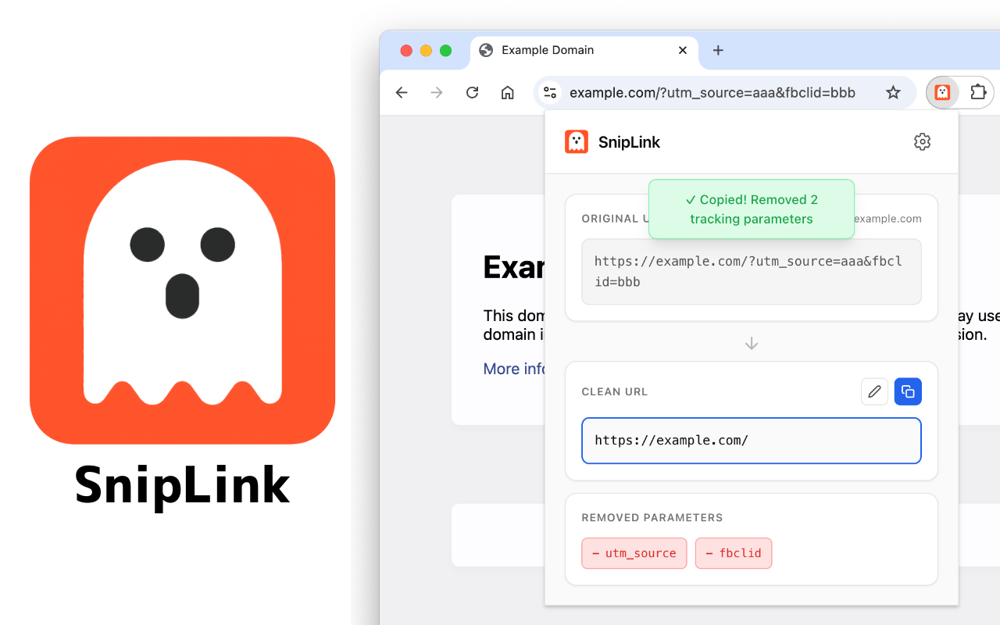

<div align="center">
  

  # SnipLink

  A Chrome extension that removes tracking parameters from URLs to create clean, shareable links.
</div>

## Features

- **URL Parameter Removal**: Automatically removes common tracking parameters (utm_*, fbclid, gclid, etc.)
- **Amazon URL Simplification**: Extracts product ASIN and creates minimal URLs with optional affiliate tag support
- **Domain Whitelisting**: Skip cleaning for specific domains
- **Custom Parameters**: Add your own tracking parameters to remove
- **Multiple Access Methods**:
  - Popup interface
  - Right-click context menu on links/pages

## Screenshots



## Installation

### From Chrome Web Store
(Coming soon)

### For Development

1. Clone the repository:
   ```bash
   git clone https://github.com/wozozo/sniplink.git
   cd sniplink
   ```

2. Install dependencies:
   ```bash
   pnpm install
   ```

3. Build the extension:
   ```bash
   pnpm build
   ```

4. Load in Chrome:
   - Open `chrome://extensions/`
   - Enable "Developer mode"
   - Click "Load unpacked"
   - Select the `sniplink` directory

## Development

### Available Commands

```bash
# Build TypeScript files
pnpm build

# Watch mode for development
pnpm watch

# Type checking
pnpm typecheck

# Linting
pnpm lint

# Format code
pnpm format

# Run lint and format with auto-fix
pnpm check

# Run tests
pnpm test

# Run tests with UI
pnpm test:ui

# Package extension as zip file
pnpm package
```

### Project Structure

```
sniplink/
├── src/
│   ├── background.ts     # Service worker for context menus
│   ├── popup.ts         # Popup UI logic
│   ├── options.ts       # Options page logic
│   ├── offscreen.ts     # Offscreen document for clipboard operations
│   ├── shared.ts        # Shared URL cleaning logic
│   └── test/           # Test files
├── popup.html          # Popup UI
├── options.html        # Options page
├── offscreen.html      # Offscreen document
└── manifest.json       # Extension manifest
```

## Usage

### Popup Interface
1. Click the SnipLink icon in your browser toolbar
2. The current tab's URL will be automatically cleaned
3. View the original URL, cleaned URL, and removed parameters
4. Click "Copy to Clipboard" to copy the clean URL

### Context Menu
- Right-click on any link and select "Copy clean link" to copy without tracking parameters
- Right-click on a page and select "Copy clean link for this page"

### Options
Access the options page by:
- Right-clicking the extension icon and selecting "Options"
- Or visiting `chrome://extensions/` and clicking "Options" under SnipLink

Configure:
- Custom tracking parameters to remove
- Domains to whitelist (skip cleaning)
- Amazon Associate ID for affiliate links
- Default parameter removal toggles

#### Settings Storage & Sync
- All settings are stored in Chrome's sync storage (`chrome.storage.sync`)
- Settings automatically sync across all devices where you're signed into Chrome with the same Google account
- Settings persist through extension updates and Chrome reinstalls
- To reset all settings to defaults:
  1. Go to the Options page
  2. Clear all custom parameters and whitelist entries
  3. Or uninstall and reinstall the extension to start fresh

## Privacy

SnipLink operates entirely locally in your browser. It does not:
- Send any data to external servers
- Track your browsing activity
- Store your browsing history
- Require any account or login

All URL cleaning happens directly in your browser.

## Contributing

Contributions are welcome! Please feel free to submit a Pull Request.

## License

MIT License - see LICENSE file for details